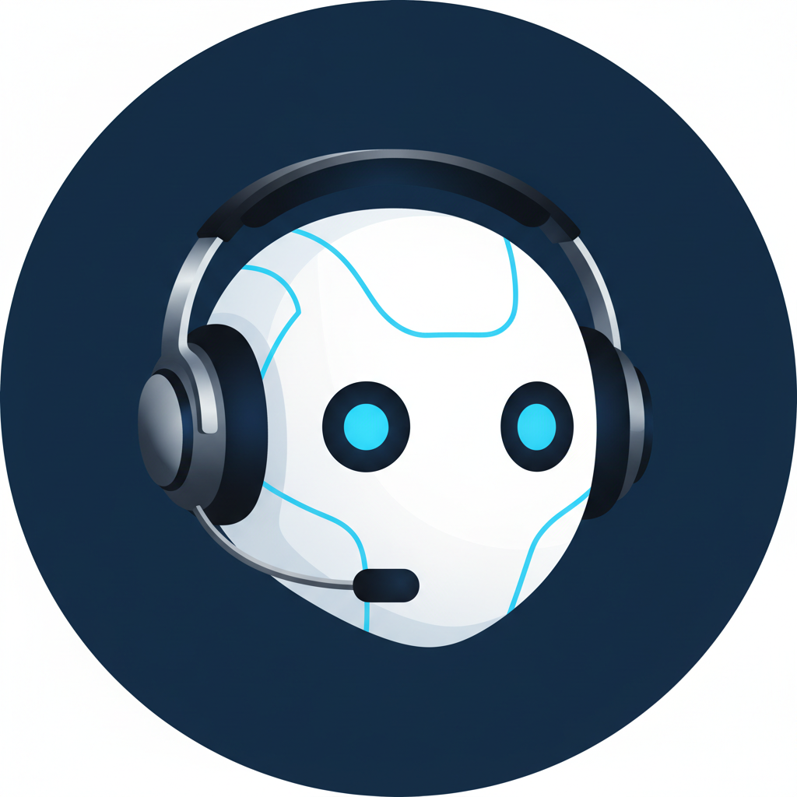
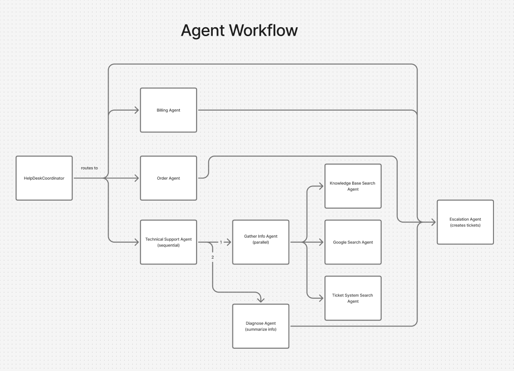

# Customer Support Multi-Agent System

## Overview
<table>
<tr>
<td width="200">

</td>
<td>
This project implements an AI-powered customer support agent for E-Commerce Company. <br/><br/>
The agent is designed to provide excellent customer service, assist customers with orders and billings issues, troubleshoot technical problems, create support tickets and check their status.<br/><br/>
The agent is built using  <a href="https://google.github.io/adk-docs/">Google Agent Development Kit (ADK)</a> and follows a modular architecture.
</td>
</tr>
</table>

## Problem Statement

Running customer support at scale is expensive and difficult. Companies must invest heavily in infrastructure, hire and train large teams, and deal with constant staff turnover. Even with trained human agents, it's hard to maintain consistent quality and fast response times across thousands of daily interactions. The core problem is complexity: customer inquiries cover a wide range of topics (billing questions, order issues, technical problems, policy clarifications) and resolving a single request often requires accessing multiple internal systems at once, such as CRM databases, order management tools, billing platforms, and knowledge bases. This variety makes traditional automation approaches ineffective, as no simple set of rules can handle the full spectrum of customer needs.

## Solution Statement

AI agents offer a promising solution to this challenge. Unlike traditional chatbots that follow rigid scripts, modern AI agents can understand natural language, reason about complex requests, and dynamically interact with multiple backend systems to resolve issues end-to-end. They can handle thousands of conversations simultaneously, provide instant responses 24/7, and maintain consistent service quality regardless of volume. Modern frameworks like Google's Agent Development Kit (ADK) make these agents not only effective but also transparent, enabling teams to track detailed performance metrics, monitor decision-making processes, and continuously improve the agent based on real-world interactions. This approach dramatically reduces operational costs while improving speed, quality, and customer satisfaction over time.

## Agent Details

### Agent Architecture


The solution is built using multi-agent architecture. It mocks interactions with various tools and services, including CRM, order management, ticket tracking system and knowledge base. The agent also utilizes a session management system to maintain context across interactions and personalize the customer experience.

The solution implements several patterns of **multi-agent** architecture:

- **LLM Orchestrator**
    - Help Desk Coordinator
      - Root agent greeting user, identifying the purpose of inquiry and dynamically forwarding execution to appropriate 'specialist agent'
      - Justification: flexible flow allows to efficiently and seamlessly route user 
- **Sequential**
  - Technical Support Agent 
    - first runs parallel_info_gathering agent to fetch issue related information from multiple sources, 
    then passes to diagnosis_synthesizer
    - Justification: ensures that the step of solution synthesis step happens after all information sources are requested 
- **Parallel**
  - parallel_info_gathering agent
    - In parallel searches on the internet, in the knowledge base and in the ticket tracking system for the relevant information for the problem solving 
    - Justification: parallel execution of independent requests speeds up overall response  

**Custom Tools** usage is demonstrated by 
- Order Agent which is able to fetch order related information by order ID and present this information to the user.
- Help Desk Coordinator informs user about ticket status getting information from Session about user recent tickets and ticket tracking system
- Escalation agent which is able to create new tickets basing on the problem discussed in the conversation history
- parallel_info_gathering fetching relative information from the knowledge base and tracking system

**Built-in Tools** usage: google_search_agent which looks up related information online

**Session** usage demonstrated by proactive fetching user profile from the mocked CRM and storing it in the session to make following conversation personalized and more relevant - the agent knows recent tickets context in advance.

It is important to notice that this agent is not integrated to an actual backend and the behaviour is based on mocked tools. 

### Key Features

- **Personalized Customer Assistance:**
  - Greets returning customers by name and acknowledges their support tickets history.
  - Maintains a friendly, empathetic, and helpful tone.
- **CS Tickets Tracking:**
  - Provides information about support tickets status by ticket ID 
  - Identifies recent user ticket and gives an update
- **Order Tracking:**
  - Provides information about order status and content given an order ID
- **Technical Assistance:**
  - Investigates the problem stated by the user
    - Fetches related information from the knowledge base
    - Searches relevant information on the internet
    - Checks support ticket system for relevant inquiries
    - Combines all gathered information in single comprehensive response
    - Provides steps to resolve the problem
- **Escalation:**
  - Creates support tickets if nothing above helped
- **Evaluation:**
  - The agent can be evaluated using a set of eval cases.
  - The evaluation is based on the agent's ability to use the tools and to respond to the user's requests.
- **Deployment:**  
  - The project is ready for deployment (and deployed) to Google Agent Engine

#### Agent State - Default customer information

The agent's session state is preloaded with sample customer data, simulating a real conversation. Ideally, this state should be loaded from a CRM system at the start of the conversation, using the user's information. This assumes that either the agent authenticates the user or the user is already logged in. 

#### Tools

The agent has access to the following custom tools:

- `search_knowledge_base(query: str, max_results: int = 3) -> dict`: Searches the knowledge base for articles matching the query. Returns relevant articles with titles, categories, and content.
- `get_order_status(order_id: str) -> str`: Retrieves the current status of an order by its ID.
- `get_user_context(user_id: str = None) -> dict`: Retrieves information about the user's account, plan type, and recent support history.
- `create_ticket(summary: str, category: str, priority: str, description: str, attempted_solutions: list = None) -> dict`: Creates a new support ticket and assigns it to the appropriate team for human review.
- `search_similar_tickets(description: str, category: str = None, limit: int = 3) -> dict`: Searches for previously resolved tickets similar to the current issue to find potential solutions.
- `get_ticket_status(ticket_id: str) -> dict`: Gets the current status and details of a support ticket.
- `assign_to_team(category: str, priority: str) -> dict`: Determines which team should handle an issue based on category and priority.

Built in tools used:

- `Google Search`

### Workflow


## Setup and Installations

### Prerequisites

- Python 3.10+
- Google ADK SDK
- Google Cloud Project (for Vertex AI Gemini integration)

### Installation
1.  **Prerequisites:**

    For the Agent Engine deployment steps, you will need a Google Cloud Project. Once you have created your project,
    [install the Google Cloud SDK](https://cloud.google.com/sdk/docs/install).
    Then run the following command to authenticate with your project:
    ```bash
    gcloud auth login
    ```
    You also need to enable certain APIs. Run the following command to enable
    the required APIs:
    ```bash
    gcloud services enable aiplatform.googleapis.com
    ```

2. Clone the repository:

    ```bash
    git clone https://github.com/silentcharacter/cs_agent
    cd cs_agent
    ```

3. Install dependencies:

    ```bash
    pip install -r requirements.txt
    ```

4.  Set up Google Cloud credentials:

    - Ensure you have a Google Cloud project.
    - Make sure you have the Vertex AI API enabled in your project.
    - Set the `GOOGLE_GENAI_USE_VERTEXAI`, `GOOGLE_CLOUD_PROJECT`, and `GOOGLE_CLOUD_LOCATION` environment variables. You can set them in your `.env` file (modify and rename .env_sample file to .env) or directly in your shell. 

    ```bash
    export GOOGLE_CLOUD_PROJECT=YOUR_PROJECT_NAME_HERE
    export GOOGLE_GENAI_USE_VERTEXAI=1
    export GOOGLE_CLOUD_LOCATION=us-central1
    ```
 
## Running the Agent

You can run the agent using the ADK commant in your terminal.
from the root project directory:

1.  Run agent in CLI:

    ```bash
    adk run cs_agent
    ```

2.  Run agent with ADK Web UI:
    ```bash
    adk web
    ```
    Select the cs_agent from the dropdown


## Evaluating the Agent

Evaluation tests assess the overall performance and capabilities of the agent in a holistic manner.
    
Run Evaluation Tests:

```bash
adk eval cs_agent cs_agent/cs_agent_evalset.evalset.json --config_file_path=cs_agent/test_config.json --print_detailed_results
```


## Deployment on Google Agent Engine

```bash
adk deploy agent_engine cs_agent --agent_engine_config_file=cs_agent/.agent_engine_config.json
```

### Testing deployment

This code snippet is an example of how to test the deployed agent.

```python
import vertexai
from customer_service.config import Config
from vertexai.preview.reasoning_engines import AdkApp

configs = Config()

vertexai.init(
    project="<GOOGLE_CLOUD_LOCATION_PROJECT_ID>",
    location="<GOOGLE_CLOUD_LOCATION>"
)

# get the agent based on resource id
agent_engine = vertexai.agent_engines.get('DEPLOYMENT_RESOURCE_NAME') # looks like this projects/PROJECT_ID/locations/LOCATION/reasoningEngines/REASONING_ENGINE_ID

for event in remote_agent.stream_query(
    user_id=USER_ID,
    session_id=session["id"],
    message="Hello!",
):
    print(event)

```

### Cleanup

```bash
export GOOGLE_CLOUD_PROJECT = <>
export GOOGLE_CLOUD_LOCATION = <>
python deployment/cleanup.py
```


## Project Structure

The project is organized as follows:

- `cs_agent/` : The main Python package for the agent.
  - `agent.py` : Defines the main `HelpDeskCoordinator` agent and orchestrates the sub-agents.
  - `agent_utils.py` : Utility functions for the agent.
  - `sub_agents/` : Contains the individual sub-agents, each responsible for a specific task.
    - `billing_agent.py` : Handles billing and payment inquiries.
    - `order_agent.py` : Handles order status, shipping, and refund questions.
    - `technical_support_agent.py` : Investigates technical issues using parallel search (Google, KB, tickets).
    - `escalation_agent.py` : Creates support tickets for human review.
  - `tools/` : Defines the custom tools used by the agents.
    - `kb_tools.py` : Knowledge base search tool.
    - `order_tools.py` : Order status lookup tool.
    - `user_context.py` : User account information tool.
    - `ticket_system.py` : Ticket creation and management tools.
    - `solutions.py` : Solution generation tool.
  - `session/` : Session state management.
    - `state_schema.py` : State schema definitions.
    - `state_helpers.py` : Helper functions for state management.
  - `cs_agent_evalset.evalset.json` : Evaluation test cases for the agent.
  - `test_config.json` : Test configuration.
- `deployment/` : Deployment utilities.
  - `cleanup.py` : Script to clean up deployed resources.
